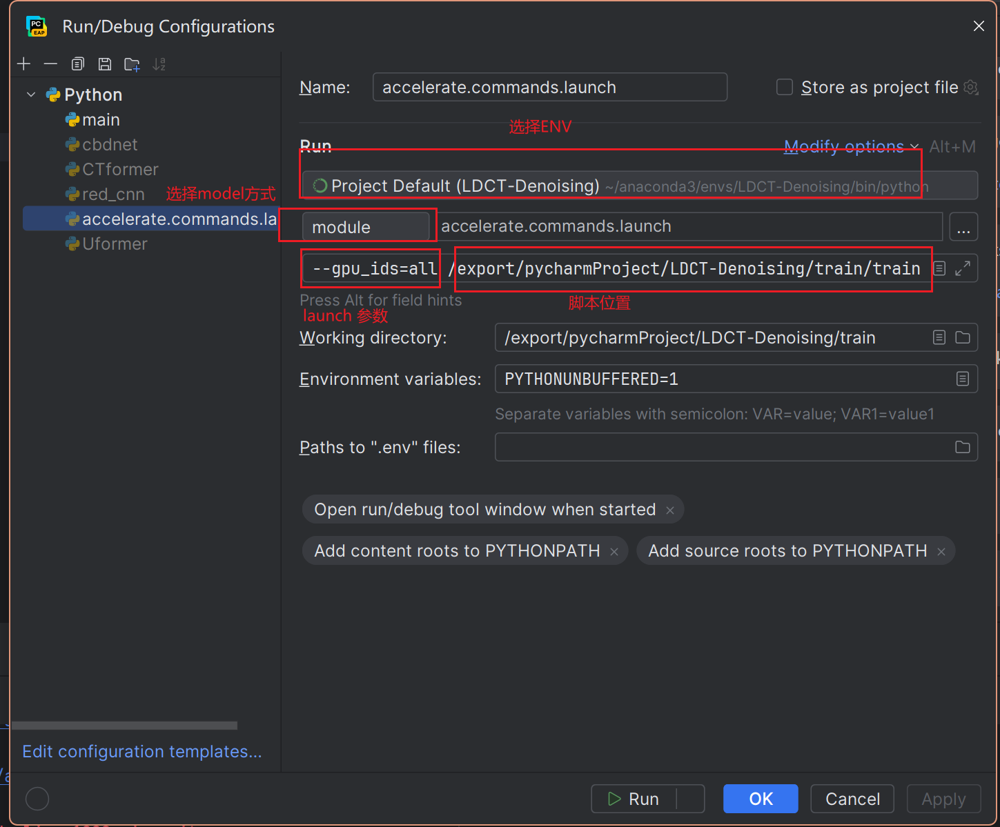

## WiTUnet: A New U-Shaped Architecture Integrating CNN and Transformer for Improved Feature Alignment and Fuse local and non-local Information.

<b>
Bin Wang, 
<a href='https://dengfei-ailab.github.io'>Deng Fei</a>, 
<a href='https://github.com/jiangpeifan'>Peifan Jiang</a>
</b>

<hr>
<i>Low-dose computed tomography (LDCT) has emerged as the preferred technology for diagnostic medical imaging due to the potential health risks associated with X-ray radiation and conventional computed tomography (CT) techniques. While LDCT utilizes a lower radiation dose compared to standard CT, it results in increased image noise, which can impair the accuracy of diagnoses. To mitigate this issue, advanced deep learning-based LDCT denoising algorithms have been developed. These primarily utilize Convolutional Neural Networks (CNNs) or Transformer Networks and often employ the Unet architecture, which enhances image detail by integrating feature maps from the encoder and decoder via skip connections. However, existing methods focus excessively on the optimization of the encoder and decoder structures while overlooking potential enhancements to the Unet architecture itself. This oversight can be problematic due to significant differences in feature map characteristics between the encoder and decoder, where simple fusion strategies may hinder effective image reconstruction. In this paper, we introduce WiTUnet, a novel LDCT image denoising method that utilizes nested, dense skip pathway in place of traditional skip connections to improve feature integration. Additionally, to address the high computational demands of conventional Transformers on large images, WiTUnet incorporates a windowed Transformer structure that processes images in smaller, non-overlapping segments, significantly reducing computational load. Moreover, our approach includes a Local Image Perception Enhancement (LiPe) module within both the encoder and decoder to replace the standard multi-layer perceptron (MLP) in Transformers, thereby improving the capture and representation of local image features. Through extensive experimental comparisons, WiTUnet has demonstrated superior performance over existing methods in critical metrics such as Peak Signal-to-Noise Ratio (PSNR), Structural Similarity (SSIM), and Root Mean Square Error (RMSE), significantly enhancing noise removal and image quality.</i>


---
- overall structure

(a) Illustrates the U-shaped network architecture of WiTUnet, featuring encoder and decoder connected by nested dense blocks. (b) Describes the structure of the encoder, bottleneck and decoder, consisting of $N$ WT blocks, and for the decoder, an additional channel projection is depicted.  (c) Details the WT block, highlighting the layers and their functions, including Layer Normalization and Local Image Perception Enhancement (LiPe).
- nested dense block

(a) Demonstrates the nested dense network structure of WiTUnet, highlighting the complex skip connectiion approach. In the figure, $X_{k,0}$ where $k\in [0,D)$ represents the encoder at different layers, $X_{k,v}$ where $k\in [0,D)$ and $v=D-k$ represents the decoder, and$ X_{D,0}$ is the bottleneck layer. The green and blue arrows show the specially designed jump paths. The redesigned path changes the connection between the codecs, and the encoder's feature map needs to be processed through multiple dense convolutional blocks before it can be passed to the decoder. (b) The computational process at each node is described to help understand the flow and processing of information throughout the network structure.
- LiPe

The diagram visualizes the Local Image Perspective Enhancement (LiPe) module, showcasing the sequence of operations including convolutional layers and the transformation from image to token and back, facilitating the feature refinement process within the network architecture.

---

## Result
- Res

(a) LDCT. (b) FDCT. (c) DnCNN. (d) REDCNN. (e) ADNet. (f) NBNet. (g) CTformer. (h) WiTUnet. This figure also includes magnified views of the region of interest (ROI) for each denoising method. To visualize the differences between the denoising results and the FDCT images, differential visualizations are provided, depicting the noise reduction outcome relative to the FDCT. The display window is set to [-160, 240] Hounsfield Units (HU) to enhance the visualization. Additionally, to optimize the visual presentation, the brightness of all visualization results has been adjusted.

- ANOVA

(a) An ANOVA boxplot displaying the distribution of Structural Similarity Index (SSIM) values for six denoising methods, highlighting median, quartiles indicating image quality after denoising. (b) An ANOVA boxplot showing the Peak Signal-to-Noise Ratio (PSNR) performance of the same denoising methods, with higher PSNR values denoting better image restoration quality. (c) An ANOVA boxplot depicting the Root Mean Square Error (RMSE) across the denoising methods, where lower RMSE values represent smaller differences between the denoised and original images, suggesting superior denoising efficacy.
---
## The datasets and parallel framework of this framework are based on huggingface datasets&&accelerate
In addition to the pytorch environment, the following additional libraries are required before you can run it
```shell
pip install datasets accelerate timm einops scikit-image
```

Between the first runs, a configuration file is generated by accelerate, which tells accelerate which GPUs are currently involved in the training.
```shell
accelerate config
```


After configuring the accelerate config file, you can view the configuration via `accelerate env` and test the hardware via `accelerate test`.

The test script is as follows


---
You can then run `train.py` to train on a single card.

For multi-card training please cmd call
```shell
accelerate launch --gpu_ids=all  /export/pychamProject/LDCT-Denoising/train.py
```

---
If you find the cmd call scripts inelegant, you can also configure pycharm
- Create a new Run/Debug Configuration.
- Set the ENV of the RUN
- Set the mode to module, and give the model name: `accelerate.commands.launch`.
- Set parameter `--gpu_ids=all` to set available GPUs, specify script path `/{your_path}/LDCT-Denoising/trian.py`.


For more distributed training parameters see https://huggingface.co/docs/accelerate/v0.28.0/en/basic_tutorials/launch

